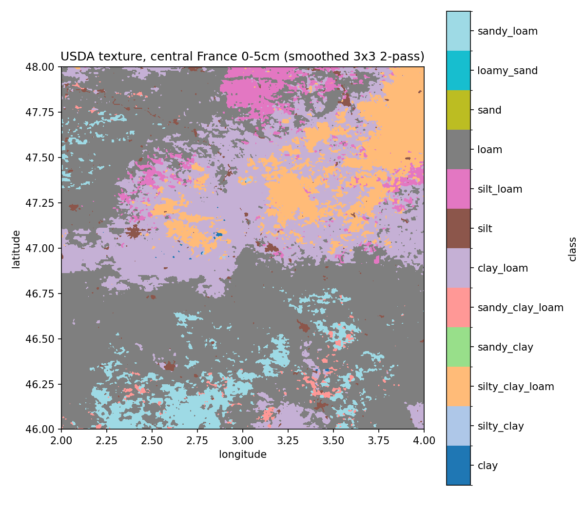
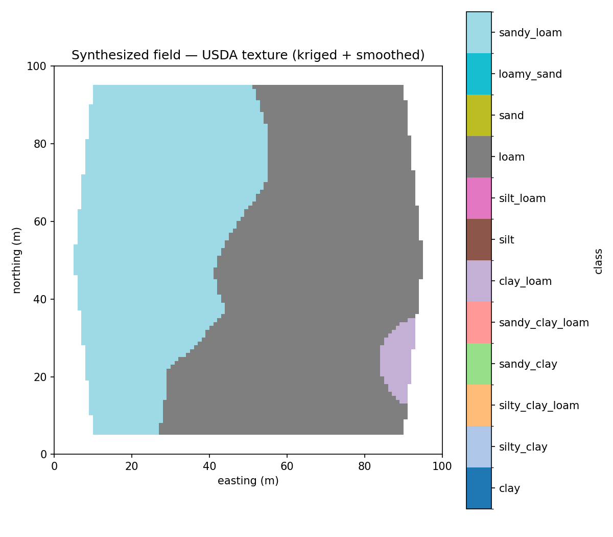
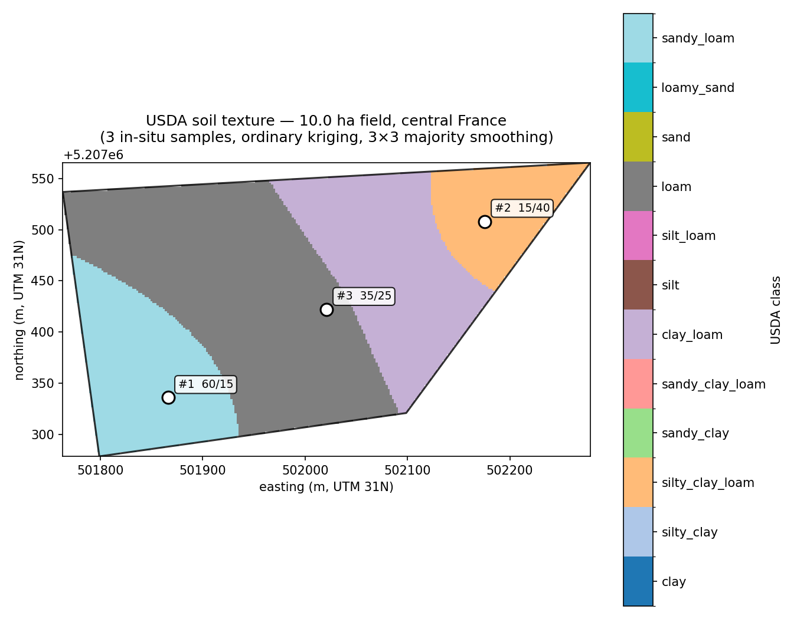

# pedotri

[](https://pypi.org/project/pedotri/)
[](https://pypi.org/project/pedotri/)
[](https://github.com/ivanfeanor/pedotri/blob/main/LICENSE)
[](https://github.com/ivanfeanor/pedotri/actions/workflows/ci.yml)
[](https://codecov.io/gh/ivanfeanor/pedotri)
[](https://ivanfeanor.github.io/pedotri/)
[](https://pypi.org/project/pedotri/)

Modern, extensible soil texture classification and pedotransfer functions for Python.

- **Vectorized** point-in-polygon classification via numpy — fast on large arrays.
- **Extensible.** Define your own classifications in TOML and load them at runtime, or ship them as plugins via `entry_points`.
- **Multilingual.** Class names available in English, French, German, Spanish, Russian, and Portuguese, with locale fallback.
- **Comprehensive.** Built-in classifications from around the world: USDA, FAO, GEPPA/Jamagne, KA5, HYPRES, Kachinsky, Embrapa, and more.
- **Beyond classification.** Pedotransfer functions (Saxton-Rawls, Wösten / HYPRES), particle-size standard conversions, class hierarchies, distance-to-boundary, and a pure-SVG triangle renderer.

## Install

```bash
pip install pedotri                 # core only (numpy)
pip install "pedotri[matplotlib]"   # static plots
pip install "pedotri[plotly]"       # interactive plots
pip install "pedotri[pandas]"       # DataFrame accessor
pip install "pedotri[polars]"       # Polars accessor
pip install "pedotri[mcp]"          # MCP server for Claude Desktop / Cursor
pip install "pedotri[raster]"       # GeoTIFF + smoothing (rasterio + scipy)
pip install "pedotri[vector]"       # Shapefile / GeoJSON output (shapely + fiona)
pip install "pedotri[interp]"       # Ordinary kriging for field samples (pykrige)
pip install "pedotri[all]"          # everything
```

## Quick start

```python
import pedotri

# Single point — returns the class key
pedotri.classify(13, 50, "USDA")
# 'clay'

# Batch (vectorized)
pedotri.classify([13, 45, 70], [50, 24, 10], "FAO")
# ['fine', 'medium', 'coarse']

# Localized class names
pedotri.classify(13, 50, "USDA", locale="fr")
# 'argile'
pedotri.classify(13, 50, "GEPPA", locale="fr")
# 'argile lourde'

# 1-D classifications (single axis)
pedotri.classify(35, "KACHINSKY")
# 'medium_loam'

# Rich result with hierarchy and signed distance to boundary
result = pedotri.classify(13, 50, "USDA", detailed=True)
result.key       # 'clay'
result.name      # 'clay'        (localized name; identical to key for USDA en)
result.group     # 'fine'
result.distance  # positive when strictly inside the class polygon
```

## Built-in classifications

| Key             | Region          | Axes              | Classes | Reference                                          |
|-----------------|-----------------|-------------------|---------|----------------------------------------------------|
| `USDA`          | USA (global)    | sand, clay        | 12      | USDA Soil Survey Manual (Handbook 18, 1993)        |
| `FAO`           | International   | sand, clay        | 3       | Verheye & Ameryckx 1984 (FAO grouping)             |
| `INTERNATIONAL` | International   | sand, clay        | 11      | Leeper & Uren 1993                                 |
| `ISSS`          | International   | sand, clay        | 12      | ISSS / Verheye & Ameryckx 1984                     |
| `AVERY`         | UK              | sand, clay        | 12      | Avery 1980 (Soil Survey of England and Wales)      |
| `JAMAGNE`       | France          | sand, clay        | 13      | Jamagne 1967 (original)                            |
| `GEPPA`         | France          | sand, clay        | 14      | Baize & Jamagne 1995 (GEPPA-Aisne refinement)      |
| `HYPRES`        | Europe          | sand, clay        | 5       | Wösten et al. 1999                                 |
| `KA5`           | Germany         | sand, clay        | 31      | Bodenkundliche Kartieranleitung 5 (full subdivision) |
| `PTG`           | Poland          | sand, clay        | 6       | Polskie Towarzystwo Gleboznawcze 2008              |
| `NORTHCOTE`     | Australia       | sand, clay        | 16      | Northcote 1979 (Factual Key, fine clay subdivisions) |
| `CHINA`         | China           | sand, clay        | 6       | GB/T 17296-2009 (Chinese national standard)        |
| `EMBRAPA`       | Brazil          | sand, clay        | 5       | Embrapa, SiBCS 5ª ed. 2018                         |
| `KACHINSKY`     | Russia / CIS    | physical_clay     | 9       | Качинский 1965 (1-D classification by <0.01 mm fraction) |
| `RUS2004`       | Russia (current)| physical_clay     | 6       | Шишов и др. 2004 (Russian 2004 6-class "разновидности") |

## API for one- and two-axis classifications

Most classifications are defined on the sand-silt-clay simplex (2-D); a few — like Kachinsky — are defined on a single axis (e.g. percent particles <0.01 mm). `classify()` adapts to the chosen classification:

```python
pedotri.classify(70, 20, "USDA")              # 2-D positional
pedotri.classify(10, "KACHINSKY")             # 1-D positional
pedotri.classify(sand=70, clay=20, classification="USDA")           # 2-D kwargs
pedotri.classify(physical_clay=10, classification="KACHINSKY")      # 1-D kwargs
```

## Custom classifications

Define your own classification in TOML and load it:

```python
pedotri.register_classification("path/to/my_classification.toml")
pedotri.classify(40, 30, classification="MY_CLASSIFICATION")
```

See [docs/custom-classifications](https://ivanfeanor.github.io/pedotri/custom/) for the schema.

## Texture diagrams

Three backends share the same API and accept the same arguments. Pick whichever fits your output target.

### Built-in SVG (no plotting dependency)

```python
from pedotri.plot import render_svg, TextureDiagram

svg = render_svg("USDA", title="USDA Soil Texture Triangle")
TextureDiagram("GEPPA", locale="fr").save("geppa.svg")

# Inline in Jupyter via _repr_svg_
TextureDiagram("USDA", points=[(40, 25), (15, 60)], point_labels=["A", "B"])
```

### Matplotlib (`pip install pedotri[matplotlib]`)

```python
from pedotri.plot import render_mpl

fig = render_mpl("USDA", points=[(40, 25)], point_labels=["sample"])
fig.savefig("usda.pdf")
```

### Plotly (`pip install pedotri[plotly]`)

Uses Plotly's native ternary subplot — full interactivity, hover tooltips, export to interactive HTML.

```python
from pedotri.plot import render_plotly

fig = render_plotly("USDA", points=[(40, 25)], point_labels=["sample"])
fig.write_html("usda.html")
```

1-D classifications (e.g. Kachinsky) render as a horizontal banded axis in all three backends.

## DataFrame accessors

When `pandas` or `polars` is installed, `import pedotri` registers a `.soil` accessor on DataFrames:

```python
import pandas as pd
import pedotri  # registers df.soil

df = pd.DataFrame({"sand": [60, 20, 70], "clay": [10, 50, 5]})
df["texture"] = df.soil.classify("USDA")

# Localized names
df["fr"] = df.soil.classify("GEPPA", locale="fr")

# Different column names
df2 = pd.DataFrame({"S": [60], "C": [10]})
df2.soil.classify("USDA", columns={"sand": "S", "clay": "C"})
```

Polars works identically:

```python
import polars as pl
df = pl.DataFrame({"sand": [60, 20], "clay": [10, 50]})
df.with_columns(texture=df.soil.classify("USDA"))
```

## Command-line interface

```bash
pedotri list                                              # list registered classifications
pedotri info USDA                                          # show details for one
pedotri classify --sand 60 --clay 20 -c USDA               # single sample
pedotri classify -c KACHINSKY --physical-clay 35           # 1-D
pedotri classify --csv samples.csv --output out.csv -c USDA # batch
pedotri render -c USDA --title "USDA" -o usda.svg          # write an SVG
```

## Use as an LLM tool

pedotri ships ready-made JSON tool schemas and an MCP server so models can call it directly.

### Anthropic API / OpenAI tool use

```python
import pedotri.ai
from anthropic import Anthropic

client = Anthropic()
response = client.messages.create(
    model="claude-sonnet-4-5",
    max_tokens=1024,
    tools=pedotri.ai.tool_schemas(),
    messages=[{"role": "user", "content": "What's the texture of a 60/20/20 sand/clay/silt sample under USDA?"}],
)
# When the model returns tool_use blocks, dispatch them:
for block in response.content:
    if block.type == "tool_use":
        result = pedotri.ai.run(block.name, block.input)
        # → {"key": "sandy_clay_loam", "name": "sandy clay loam", "group": "moderately_fine", ...}
```

Eight tools are exposed: `classify_soil`, `classify_soil_1d`, `list_classifications`, `classification_info`, `saxton_rawls`, `wosten`, `convert_particle_size`, `render_diagram`. Errors come back as structured envelopes (not raised) so the model can self-correct in a tool-use loop. `render_diagram` returns an inline image (PNG by default, or pass `format="svg"`) so MCP clients like Claude Desktop and Cursor display the triangle directly in chat.

### Claude Desktop (MCP)

Install with the MCP extra and add to your Claude Desktop config:

```bash
pip install "pedotri[mcp]"
```

On macOS, edit `~/Library/Application Support/Claude/claude_desktop_config.json`:

```json
{
  "mcpServers": {
    "pedotri": {
      "command": "pedotri-mcp"
    }
  }
}
```

Claude will then see all eight pedotri tools in every conversation and can call them while reasoning about soil samples.

## Units

**Every fraction input in pedotri is *percent* by default** (0-100 range). Lab reports commonly use g/kg (especially for organic matter) or g/g (mass fraction); pass `units="g/kg"` or `units="g/g"` to convert at the boundary:

```python
# Same soil sample, three input conventions
pedotri.classify(60, 20, "USDA")                        # percent (default)
pedotri.classify(600, 200, "USDA", units="g/kg")        # g/kg
pedotri.classify(0.6, 0.2, "USDA", units="g/g")         # mass fraction

# Saxton-Rawls with organic-matter in g/kg
saxton_rawls(sand=40, clay=20, organic_matter=20, units="g/kg")
```

The `units=` keyword is accepted by `classify()`, `saxton_rawls()`, `wosten()`, and `psd.convert()`.

**Organic carbon vs. organic matter:** PTFs (Saxton-Rawls, Wösten) expect organic *matter*, but most lab reports give organic *carbon*. Convert with `pedotri.units.organic_carbon_to_organic_matter()` (Van Bemmelen factor 1.724) first:

```python
from pedotri.units import organic_carbon_to_organic_matter

oc_pct = 1.16  # from lab report (% organic carbon)
om_pct = float(organic_carbon_to_organic_matter(oc_pct)[0])  # ~2.0 %
saxton_rawls(sand=40, clay=20, organic_matter=om_pct)
```

`pedotri.units` also exposes `g_per_kg_to_percent`, `percent_to_g_per_kg`, `g_per_g_to_percent`, `percent_to_g_per_g`, `organic_matter_to_organic_carbon`, and `to_percent` / `from_percent` for arbitrary unit identifiers.

## Pedotransfer functions

Two PTFs ship in `pedotri.ptf`:

### Saxton-Rawls (2006)

Water retention + saturated conductivity from sand, clay, and organic matter.

```python
from pedotri.ptf import saxton_rawls

r = saxton_rawls(sand=40, clay=20, organic_matter=2.0)
r.wilting_point             # theta_1500 (m³/m³)
r.field_capacity            # theta_33   (m³/m³)
r.saturation                # theta_s    (m³/m³)
r.available_water           # FC - WP
r.saturated_conductivity    # K_s (mm/h)
r.bulk_density              # g/cm³
r.air_entry_tension         # psi_e (kPa)

# Compaction-corrected output (Saxton-Rawls 2006 Eq. 6-7)
r_compacted = saxton_rawls(40, 20, 2.0, density_factor=1.10)
```

### Wösten (1999) — HYPRES Mualem-van Genuchten

```python
from pedotri.ptf import wosten

w = wosten(sand=40, silt=40, clay=20, organic_matter=2.0, bulk_density=1.4, topsoil=True)
w.theta_s                   # saturated water content
w.alpha                     # van Genuchten alpha (1/cm)
w.n                         # van Genuchten n
w.saturated_conductivity    # K_s (cm/day)
w.l                         # Mualem pore-connectivity parameter
```

Both functions accept either scalar inputs (returning one result object) or array-like inputs (returning a list).

## Raster classification (GeoTIFFs)

Classify whole rasters of sand and clay (e.g. ISRIC SoilGrids tiles)
into a class-coded output raster with one call. `pip install
'pedotri[raster]'` pulls in the rasterio dependency:

```python
from pedotri.raster import classify_geotiff, write_classified_geotiff

codes, keys, profile = classify_geotiff(
    sand="sand_0-5cm_mean.tif",
    clay="clay_0-5cm_mean.tif",
    classification="USDA",
    units="g/kg",  # SoilGrids native units
)
write_classified_geotiff("usda.tif", codes, profile=profile, keys=keys)
```

The output is a paletted **uint8** GeoTIFF with class names embedded
as band metadata and a color table — QGIS / `gdalinfo` pick up both
the legend and the colors automatically. Same call also produces a
PNG (`render_classified_png`) and a Shapefile
(`classified_to_features` + `write_features_shapefile`).



*A 2°×2° SoilGrids tile of central France (740 745 pixels at 250 m),
classified under USDA and smoothed with a 3×3 majority filter. Full
pipeline classifies in ~0.12 s on a 2024 M-series Mac.* [The
underlying GeoTIFF](docs/images/usda_central_france.tif) is a 50 KB
paletted file — drop it into QGIS to see the color table and class
names automatically. See
[`examples/soilgrids_france.py`](examples/soilgrids_france.py) for the
full pipeline (download → classify → smooth → render).

Need just the numpy path (no rasterio)?

```python
from pedotri.raster import classify_array
codes, keys = classify_array(sand_array, clay_array,
                             classification="USDA", units="g/kg")
```

## Map products: smoothing, color, PNG, vector

The raster module also bundles everything you need to ship a usable
map:

```python
from pedotri.raster import (
    smooth_codes, write_classified_geotiff,
    render_classified_png, classified_to_features,
    write_features_shapefile,
)

# Remove salt-and-pepper noise with a 3x3 majority filter
smoothed = smooth_codes(codes, window=3, iterations=2)

# Paletted uint8 GeoTIFF (QGIS picks up the colors and class names)
write_classified_geotiff("usda.tif", smoothed, profile=profile, keys=keys)

# PNG with a side colorbar legend
render_classified_png("usda.png", smoothed, keys=keys,
                      title="USDA texture", extent=(2, 4, 46, 48))

# Polygonize → Shapefile (or .gpkg / .geojson)
features = classified_to_features(smoothed, keys=keys,
                                   transform=profile["transform"])
write_features_shapefile(features, "usda.shp", crs=str(profile["crs"]))
```

## Field-scale sampling (kriging)

When you only have a handful of in-situ samples and a field boundary,
`pedotri.interp` ordinary-krieges sand and clay onto a regular grid
ready for `classify_array`:

```python
from pedotri.interp import krige_sand_clay
from shapely.geometry import Polygon

samples = [{"x": 12.3, "y": 87.1, "sand": 42.0, "clay": 18.0}, ...]
boundary = Polygon([(0, 0), (100, 0), (100, 100), (0, 100)])

sand_grid, clay_grid, profile = krige_sand_clay(
    samples, bbox=(0, 0, 100, 100), resolution=1.0,
    variogram="spherical", mask_polygon=boundary, crs="EPSG:32631",
)
codes, keys = classify_array(sand_grid, clay_grid, classification="USDA")
```



*Synthesized 100 m × 100 m field with 20 in-situ samples (SE→NW sand
gradient), kriged on a 1 m grid, classified under USDA, smoothed
3×3. The field boundary is a hexagonal polygon — cells outside it are
left transparent.* See [`examples/field_kriging.py`](examples/field_kriging.py)
for the full pipeline.

For a more realistic minimal-survey scenario — a random ~10 ha field
with **just three samples** — see
[`examples/central_france_field.py`](examples/central_france_field.py)
and the [Examples gallery](https://github.com/ivanfeanor/pedotri/wiki/Examples-gallery):



## Benchmark

`pedotri.classify` is ~50× faster than the [`soiltexture`](https://pypi.org/project/soiltexture/)
Python package on USDA classification (100 % output agreement):

| n_points | pedotri | soiltexture | speedup |
|---------:|--------:|------------:|--------:|
|     1,000 | 1.5 M/s  | 130 k/s | **11.7 ×** |
|    10,000 | 4.9 M/s  | 134 k/s | **36.7 ×** |
|   100,000 | 6.2 M/s  | 132 k/s | **46.8 ×** |
|   740,745 | 6.3 M/s  | 130 k/s | **48.3 ×** |

Reproduce on your hardware:

```bash
pip install pedotri soiltexture
python examples/bench_soiltexture.py
```

## License

MIT
